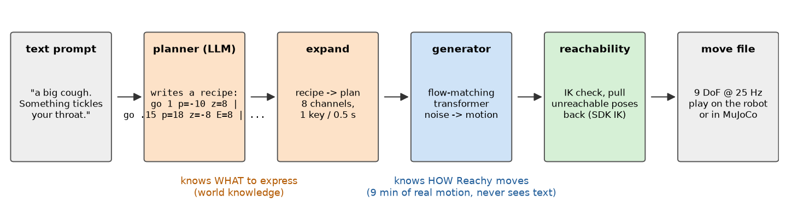
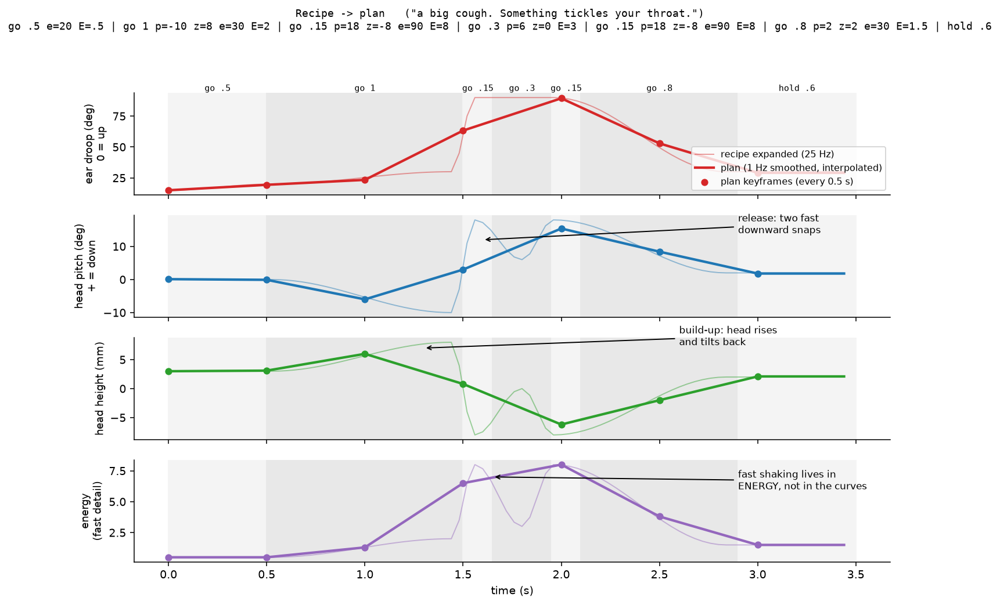
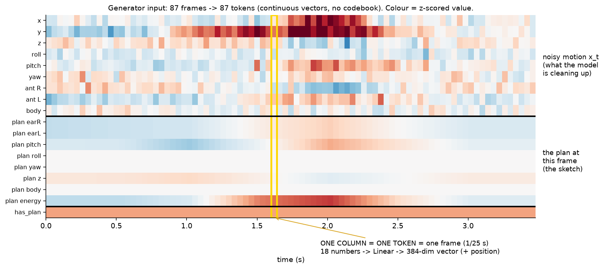
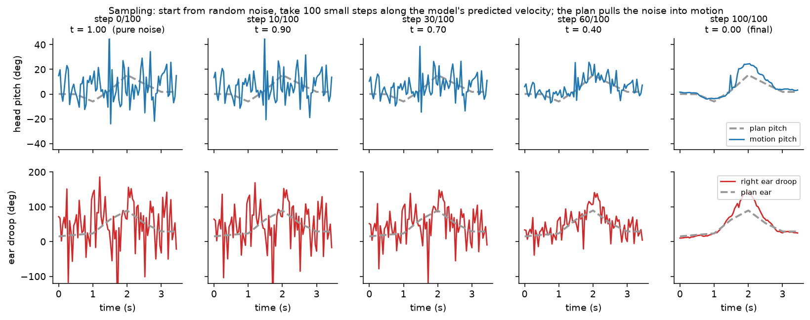
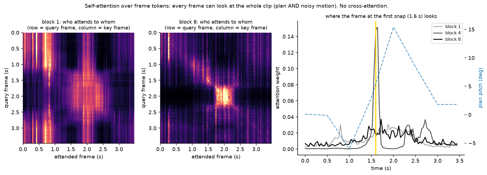
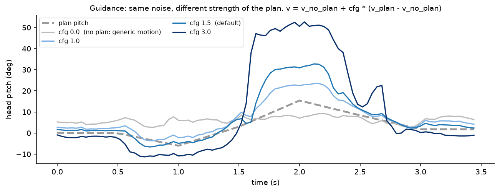
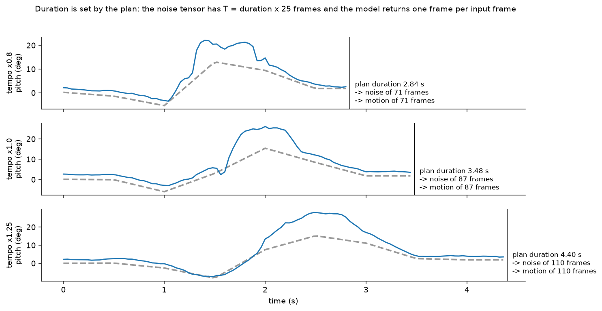
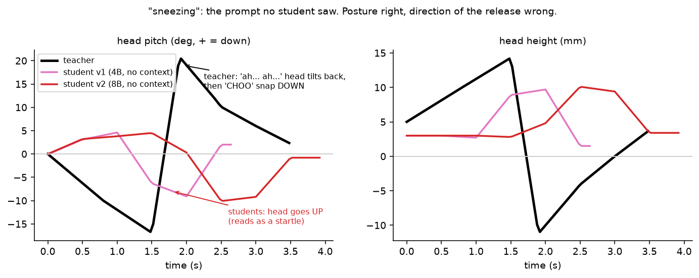
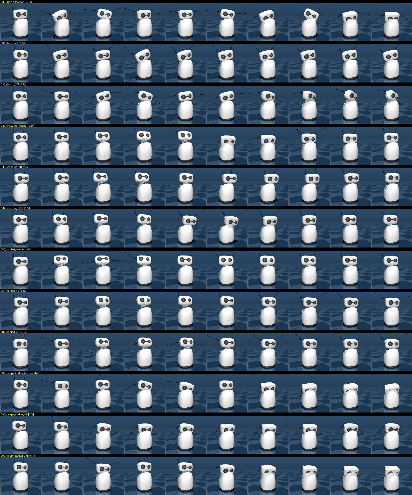

# Reference motions for Reachy Mini from text: technical report

## 1. Goal

Turn any text prompt (an emotion, a reaction, a character, a situation) into an expressive, physically
valid Reachy Mini motion. This includes prompts far outside the robot's recorded library, such as
"sleepy toddler", "a cat stalking prey" or "buffering".

The constraint that shapes everything is data. The only real expressive motion is Pollen's emotions
library (85 clips, **8.6 minutes**) plus 19 dances (0.8 min). No model trained on 9 minutes of motion
learns what "heartbroken" means. The knowledge has to come from somewhere else.

**What ships.**

| piece | what | where |
|---|---|---|
| planner, `effort: "high"` | Qwen3.8-27B fine-tuned to write motion recipes | [binhpham/reachy-mini-motion-planner-27b](https://huggingface.co/binhpham/reachy-mini-motion-planner-27b) |
| planner, `effort: "medium"` | Qwen3.5-4B, same data and recipe, 2.8× faster | [binhpham/reachy-mini-motion-planner-4b](https://huggingface.co/binhpham/reachy-mini-motion-planner-4b) |
| planner, `effort: "low"` | Qwen3.5-0.8B, same data and recipe, 4.7× faster, weaker on multi-phase motions | [binhpham/reachy-mini-motion-planner-0.8b](https://huggingface.co/binhpham/reachy-mini-motion-planner-0.8b) |
| generator | 21.8M-parameter flow-matching transformer, plan → 25 Hz 9-DoF motion | `generator.pt` inside every bundle |
| service | REST, prompt in: `POST /generate-dense` returns reachable 25 Hz trajectories (0.18 / 0.30 / 0.84 s for low / medium / high), `POST /generate-sparse` the recipe and keyframe plans only | `inference/` |
| visualizer | static page, client-side three.js playback | Space [binhpham/reachy-mini-motion-generator](https://huggingface.co/spaces/binhpham/reachy-mini-motion-generator) |
| motion library | all 10,872 teacher rows as LeRobot episodes with video | [binhpham/reachy-mini-massive-motion-library](https://huggingface.co/datasets/binhpham/reachy-mini-massive-motion-library) |

## 2. The robot and the data format

| DoF | Units | Notes |
|---|---|---|
| head x, y, z | m | Stewart platform: 6 motors plus 7 passive joints; the reachable set is coupled |
| head roll, pitch, yaw | rad | extrinsic xyz |
| antenna right, left | rad | right droops with **negative** angles, left with positive |
| body yaw | rad | |

A **move** is JSON: `{"description", "time": [s], "set_target_data": [{"head": 4×4, "antennas": [r, l], "body_yaw"}]}`.
Library clips are recorded at ~100 Hz. Everything here resamples to **25 Hz** using the `time` array.
Playing the raw frames at 25 fps makes them 4× too slow, which is a bug we hit early on.

## 3. Architecture: plan, then generate

```
text ──(1) planner: LLM──► recipe ──expand──► plan (8 ch @ 2 Hz) ──(2) generator──► motion (9 DoF @ 25 Hz) ──(3) reachability──► move
```

The planner started as a frontier LLM behind an API (the **teacher**, §3.2). The served planners are local
fine-tuned Qwen models (the **students**, §3.2b and §4.3–4.5c) that learned the teacher's recipes.

The split puts each kind of knowledge where it lives:

- **What the motion should express** is world knowledge: "stalking" means crouched, slow, and still with
  sudden bursts. A frontier LLM has this knowledge; a model trained on 85 clips does not.
- **How Reachy Mini's motion actually moves** means organic timing, overshoot, antenna flicks and
  micro-motion. That is learned from real motion, which the generator can use in full because it needs **no text**.

### 3.1 The motion plan (`common/plan.py`)

There is one keyframe every 0.5 s with 8 channels:

| channel | unit | meaning |
|---|---|---|
| `earR`, `earL` | deg | antenna droop: 0 = up, ~150 = fully drooped |
| `pitch`, `roll`, `yaw` | deg | head orientation (+pitch = head down) |
| `z` | mm | head height |
| `body` | deg | body yaw |
| `energy` | deg RMS | amplitude of the fast (> 1 Hz) detail on top of the posture |

The posture channels are low-passed at 1 Hz, so a plan describes posture and liveliness, not individual
wiggles. `extract(motion)` computes the plan of **any** clip. That property makes every real clip (and
every dance, which has no text) a training pair for the generator.

### 3.2 Planner (`planner/`)

The LLM does not write keyframes directly. It writes a **recipe** in a tiny language (`planner/dsl.py`):

```
go D k=v ...         ease to a target over D s (0.15–0.3 s = snaps and jolts)
hold D [E=v]         stay put
osc D ch amp per     oscillate a channel (nod, shake, sway, bounce, ear flap), period ≥ 0.3 s
```

Example, *sobbing*: `go 1 e=150 p=22 z=-16 E=5 | osc 3 z 4 .9 E=6 | hold 1 E=4`

Why a recipe rather than raw keyframes:
- It is roughly 10× fewer tokens.
- It is easy to validate. `check()` returns a precise error ("e=300 outside [-25, 175]"), which is fed
  back to the LLM for up to two repair rounds.
- It **expands into many plans**. Each recipe yields N variants with amplitude ×0.75–1.25, tempo
  ×0.8–1.25, ±15% per-segment timing jitter, ±6° ear asymmetry, and a sagittal mirror on odd variants.
  Expansion runs through the same 1 Hz low-pass and 0.5 s keying as `extract`, so LLM plans and
  extracted plans come from the same distribution.

The system prompt (`planner/prompt.py`) explains the robot, the units, and body-language guidance:
commit to agreeing posture cues, make big ear changes fast, and tell a small onset → peak → settle story.
It includes 14 worked examples. Calls go through the **Vercel AI Gateway**'s OpenAI-compatible
endpoint (`https://ai-gateway.vercel.sh/v1`) with structured outputs (a JSON schema). Models without
structured outputs automatically fall back to plain JSON. Any gateway model works (`--model provider/name`);
the default is `anthropic/claude-opus-5.5`. Prompts are sent in batches of 8 with 4 parallel workers,
and the output is resumable.

### 3.2b The served planners: model architecture

Both students are off-the-shelf Qwen checkpoints, fine-tuned with LoRA and merged; the architecture is not modified.
Qwen3.5 and Qwen3.8 share one design: a **hybrid** decoder in which three of every four layers use linear attention
(Gated DeltaNet), and every fourth uses full softmax attention.

| | Qwen3.5-4B (`medium`) | Qwen3.8-27B (`high`) |
|---|---|---|
| decoder layers | 32 (24 linear + 8 full attention) | 64 (48 linear + 16 full attention) |
| hidden size / MLP size | 2,560 / 9,216 (SwiGLU) | 5,120 / 17,408 (SwiGLU) |
| full attention | 16 query heads, 4 KV heads (GQA), head dim 256, output-gated, QK-norm | 24 query heads, 4 KV heads, head dim 256, output-gated, QK-norm |
| linear attention (Gated DeltaNet) | 16 key heads, 32 value heads, head dim 128, causal conv (kernel 4) | 16 key heads, 48 value heads, head dim 128, causal conv (kernel 4) |
| position encoding | RoPE on 25% of each head's dims (θ = 10⁷), only in full-attention layers | same |
| vocabulary / embeddings | 248,320 tokens, tied input/output embeddings | 248,320 tokens, separate LM head |
| parameters | ~4B | 26.9B language model + 0.46B vision tower + 0.42B MTP head |
| extras | 1-layer multi-token-prediction (MTP) head; vision tower (unused) | same |

What that means in practice:
- **Linear-attention layers keep a fixed-size state** instead of a growing KV cache, so only 1 layer in 4 has a KV
  cache. The shared prefix (system prompt plus chat template, ~630 tokens, against ~20 for a typical user prompt) is cheap
  to cache, and vLLM prefills it once (§4.6). The trade-off
  is that vLLM caps concurrent sequences by the number of state slots (`max_num_seqs = 16`).
- **Both are multimodal checkpoints** (`Qwen3_5ForConditionalGeneration`, text weights under `model.language_model.*`).
  Images are disabled at serving time (`limit_mm_per_prompt = 0`). Loading them as text-only `CausalLM` silently
  mismatches every key (§4.4).
- **The MTP head** predicts the token after next. vLLM uses it to draft 3 tokens that the full model then verifies in one
  pass (lossless speculative decoding). Merging the LoRA drops it, so `python -m inference.mtp add` copies it back from the
  base checkpoint.
- **Thinking is off** (`enable_thinking = False`): the answer is a short JSON, and templated reasoning did not help (§4.4).

The planner's input is the chat template with the compact system prompt (~330 words: units, the recipe grammar,
four motion rules, three examples) and the user prompt. The output is `{"idea": one sentence, "recipe": "..."}`.
Invalid recipes (the DSL checker) trigger up to two resamples at temperature 0.7.

### 3.3 Generator (`generator/`)

This is a flow-matching transformer that maps plan → motion. It has 21.8M parameters and **never sees text**.

| | |
|---|---|
| input per frame | noisy 9-DoF motion (z-scored) ‖ plan channels interpolated to that frame (z-scored) × `has_plan` ‖ `has_plan` |
| backbone | 8 pre-LN transformer blocks, d = 384, 6 heads, MLP 4×, learned positions (≤ 720 frames = 28.8 s) |
| time conditioning | sinusoidal flow time → MLP → AdaLN (shift, scale and gate per block, zero-initialised) |
| output | velocity v = x₁ − x₀ (zero-initialised head) |

The plan is **concatenated to every frame** rather than cross-attended. We learned this the hard way: a
2.4B music-diffusion backbone (ACE-Step 1.5) fine-tuned with text cross-attention learned to ignore its
conditioning. Concatenation cannot be ignored.

#### How the plan conditions the motion

1. **Plan → per-frame values.** The keyframes (every 0.5 s) are linearly interpolated to the motion's own
   25 Hz frames (`plan.frames`). A channel missing from a key holds its previous value. The result is a
   (T, 8) array, z-scored with the training statistics. The keyframes themselves are never embedded as a sequence.
2. **One token per frame.** Each frame's input is `[x_t (9 noisy DoF) | plan (8) · has | has (1)]`: 18
   real numbers, projected by one linear layer to d = 384, plus a learned position embedding. The plan's
   "embedding" is its share of that projection; there is no separate plan encoder. `has` is 0 under plan
   dropout and in the unconditional guidance pass.
3. **Self-attention only.** The 8 blocks attend bidirectionally over the frame tokens, with a key-padding
   mask for padded frames in a batch. Every token already carries its frame's plan, so each frame sees the
   whole plan and the whole noisy motion. That is where anticipation, follow-through and smooth transitions
   between keyframes come from. The flow time t is not a token: it modulates every block through AdaLN.
4. **Not discrete.** Tokens are continuous vectors with no codebook or quantization (unlike VQ-VAE or
   FAST-style motion tokenizers). Nine minutes of data is too little to learn a codebook, and quantization
   would erase the fast detail the generator exists to add. Discrete tokens appear only in the planner,
   whose recipe is ordinary text.

#### Duration
The length is fixed by the plan, not decided by the model. Sampling starts from noise with
T = round(duration × 25) frames, and the network returns one velocity per frame, so the output is exactly
T frames. Plan events land on their frames. Learned positions cover 720 frames, so a single clip is
capped at **28.8 s**; longer motions must be chained, or the model moved to relative positions. Training
covers all lengths through length buckets with a masked loss.

#### Training data
- Pollen emotions (85) and dances (19), downloaded from the HF Hub and projected onto the reachable set
  (§3.4): 20 of the 85 emotion clips had unreachable frames as recorded.
- 12 emotions are **held out** for evaluation (`common/data.py: HELD_OUT`), leaving 92 training clips.
- Augmentation: {original, sagittal mirror} × {0.8, 1.0, 1.25} time-stretch = 6 variants, **each paired
  with its own re-extracted plan**, for 552 samples.
- Samples are bucketed by length (104/176/296/496/720 frames) with a masked loss, so there is no padding
  bias. An early bug padded clips with their final pose; 47% of frames were padding, which biased the antennas.

#### Loss
- Flow matching with x_t = t·x₁ + (1−t)·x₀, t ~ sigmoid(N(−0.4, 1)), and a masked MSE on the velocity.
- A **velocity loss** on the implied clean estimate x̂₀ = x_t − t·v: the frame-difference error,
  normalised by the data's frame-difference energy and weighted by (1 − t). Without it, generated head
  and antenna speeds came out about 2× too slow (the head's 95th-percentile speed was half the real
  one). With it, speeds match real motion.
- Plan dropout of 10% trains the unconditional branch for classifier-free guidance.

#### Optimisation
AdamW (lr 3e-4, weight decay 0.01), one-cycle schedule (5% warmup), batch 16, gradient clip 1.0,
5,000 steps. With 9 minutes of data the model overfits after about 2,000 steps, so **the checkpoint with
the best held-out loss is kept**. The shipped checkpoint is from step 2,250.

#### Sampling
100 Euler steps from noise, CFG 1.5 on the plan, a 4th-order 4 Hz low-pass (the useful bandwidth of the
motion), then reachability projection. The service uses 8 steps (v1.1; 1.3° RMS from 100 steps, against 6.0° between two noise seeds, with identical
identification and motion speeds; v1 used 32) and expands recipes at 2 Hz instead of 1 Hz
(§4.6).

### 3.4 Reachability (`common/reach.py`)

Clipping each channel to a range cannot guarantee a valid pose: a tilt that is reachable at one head
height is not at another. On hardware the daemon rejects an unreachable target and **holds the last
one**, which reads as a freeze.

So every generated frame is checked with the SDK's analytical IK (`inverse_kinematics_safe`, same limits
as the daemon). An unreachable frame is replaced by a 12-step line search, in SE(3) with interpolated
body yaw, from the last reachable pose toward the target. Timing and antennas are untouched. Most
motions need 0% projection; extreme recipes need up to ~30% of frames (e.g. the jack-in-the-box's fast pop).

### 3.5 Renderer (`renderer/`)

This is faithful MuJoCo playback of the official model (`scenes/empty.xml`), mirroring the daemon's
MuJoCo backend:
- Head poses go to joint targets through the same IK.
- `data.ctrl` is driven while physics steps at 500 Hz, so the passive joints settle.
- Antennas are negated.
- Resets use a settle-and-ramp with collisions off. Snapping the motors to a target can close the
  linkage in a mirrored assembly mode, with the head facing ~165° the wrong way.
- Unreachable frames hold the last command.

Outputs are an mp4 per motion, contact sheets (one prompt, many frames: best for judging timing) and grids.

## Visual walkthrough

All figures are computed from the real code and the shipped generator (`python docs/make_figures.py`).
The running example is a teacher recipe for *"a big cough"*: a build-up, then two downward snaps.

**1. The pipeline.** The planner decides *what* to express, and the generator decides *how Reachy moves*.


**2. Recipe → plan.** The recipe (top) expands to smooth 25 Hz curves (thin lines). These are smoothed below
1 Hz and sampled every 0.5 s: the dots are the plan keyframes. The two fast snaps mostly disappear from the
posture curves and survive as **energy**. The generator's job is to put them back.


**3. What the generator actually receives.** One column per frame; each column is one token. The top 9
rows are the noisy motion being cleaned up, the next 8 are the plan's values at that frame, and the last
row is the `has_plan` flag. These 18 numbers are projected to a 384-d vector. No codebook: the values stay continuous.


**4. Sampling.** It starts from pure noise (left) and takes 100 small steps along the predicted velocity.
Structure appears around t ≈ 0.4, and the final motion (right) follows the plan (dashed) while adding sharper
peaks and detail.


**5. Attention.** Every frame can look at every other frame. Early blocks attend broadly; deeper blocks
concentrate on the event. At the snap frame (gold), block 4 looks almost only at the frames around it.


**6. Guidance.** Same noise, different plan strength. With no plan (cfg 0) the result is generic motion.
The default cfg 1.5 commits to the event, overshooting the smoothed plan on purpose; cfg 3 exaggerates it.


**7. Duration.** The same recipe at three tempos. The plan's duration sets the number of noise frames, and
the output has exactly that many frames. The model never chooses the length.


**8. Why the first local students failed on "sneezing".** The teacher tilts the head back ("ah… ah…"),
then snaps down ("choo"). Students v1 and v2 moved the head up instead, which reads as a startle (§4.3).


## 4. What we measured

**Metrics.**
- **Identification** (on the 12 held-out real emotions). Generate from the emotion's prompt, then ask
  whether the result is closer to *its own* real clip than to the other 11. Distance is time-shift-tolerant
  RMS over resampled, z-scored 9-DoF trajectories. Chance is 8.3% top-1, mean rank 6.5.
- **Descriptor agreement.** Across the 12 emotions, the Pearson r between generated and real
  per-emotion ear droop, pitch, height, yaw range and speeds.
- **Qualitative.** Videos and contact sheets on 18 out-of-distribution prompts. This is the metric that matters.

### 4.1 The generator given a good plan

| plan source → generator | top-1 | mean rank |
|---|---|---|
| true plan (extracted from the held-out clip) | **89%** | 1.31 |
| true plan played directly, no generator | 83% | — |
| LLM-written plan (this pipeline) | 22% | 4.36 |

Given the right plan, the generator reproduces an unseen emotion almost exactly, and it adds the
dynamics a plan cannot hold. Compared with playing the plan directly:
- head speed (p95) 15 → 41 deg/s
- antenna speed 142 → 235 deg/s
- jitter 1.4% → 6.1%, which matches real motion

Almost all of the remaining error is in the **plan**, that is, in the LLM's idea of how "disgusted" should
move compared with how Pollen's animator made it move. That gap reflects taste as much as quality. On OOD
prompts the LLM plans were judged the best of every system we tried.

### 4.2 Alternatives we tried (why this design)

| approach | held-out top-1 | notes |
|---|---|---|
| ACE-Step 1.5 music DiT (2.4B), LoRA-fine-tuned on text → motion, 6–208 epochs, 20–77 clips | 0–17% (chance) | memorises clips; text conditioning ignored (0/144 samples raised the ears when asked) |
| end-to-end text → motion, real clips only | 11% | copies the nearest training clip, collapses across prompts |
| end-to-end, distilled from this pipeline (2,030 generated clips + paraphrases) | 25–28% | generalises, but OOD motion is visibly tamer than the planner's |
| VLA-style end-to-end: Qwen3-VL-2B + LoRA trained on plan tokens, flow-matching action expert (π0.5 recipe) | 25–27% | the only end-to-end model with planner-level amplitude OOD; still judged worse than planner + generator |

The end-to-end models are compressed copies of the planner. On prompts they were trained on they match
it (correlation 0.69); on new prompts they blend the nearest known prompts and lose timing and extremes.
With the data available, **planner + generator is the best system**. The planner's knowledge lives in a
frontier LLM, and the generator's knowledge lives in real motion.

### 4.3 A local planner: distilling the LLM into a small model (`planner/distill/`)

The goal is to run the planner on one local GPU (an RTX 5090), with no API calls, by fine-tuning a small
LLM to write recipes. This is text → text distillation into a model already pretrained on language, a
much easier regime than the end-to-end motion models of §4.2. The student only has to learn the recipe
language and the teacher's body-language taste.

**Teacher data.**
- **Hand-written:** 585 prompt → idea + recipe rows across 11 batches. These cover:
  - emotions, including intensity ladders (subtle / clear / extreme)
  - body states and reactions
  - social and conversational-robot behaviours
  - animals, characters, robot states, music and metaphors
  - build-up → release events (coughs, throws, barks; no sneezes, so sneezing remains a true OOD test)
  - long multi-phase stories
- **Seeds:** the 287 recipes from `planner/examples/`.
- **Filtering and variants:** the eval-leak filter drops training prompts within cosine 0.72 of the 30
  eval prompts (Qwen3-Embedding-0.6B, 23 dropped). Each prompt is also trained as its bare word and its
  sentence alone.

**Training.** Unsloth LoRA (r = 32, all linear layers, loss on the answer only), 3 epochs, lr 1e-4, keeping
the best checkpoint by val loss. The adapter is then merged with PEFT for serving.

**Evaluation.** Three checks on 39 val prompts the student never saw, each with two independent teacher
recipes:
- validity
- per-descriptor correlation of the student's plans with the teacher's (duration, ear droop,
  pitch, height, yaw/roll range, energy)
- motion-level identification on the 12 held-out real emotions

| student | context given to the student | val loss | valid | plan agreement r | held-out top-1 (mean rank) | sneeze release |
|---|---|---|---|---|---|---|
| v1 Qwen3-4B, 520 rows | one-line format instruction | 0.80 | 100% | 0.66 | 22% (4.75) | head **up** |
| v2 Qwen3-8B, + events ×3 | one-line format instruction | 0.72 | 97% | 0.65 | 27% (4.62) | head **up** |
| v3 Qwen3-8B | full instructions + 5 **retrieved** examples | 0.67 | 97% | 0.58 | 25% (3.85) | head **up** |
| v4 Qwen3-8B | full instructions + **fixed** 14 examples | 0.70 | 100% | 0.64–0.67 | 20% (4.40) | head **up** |
| v5 Qwen3-8B | as v4, and it writes **timed phases in words** before the recipe | (not comparable) | — | — | — | superseded, see below |

Reference points: the teacher scores 22% (4.36) on the same held-out metric, chance is 8.3% (6.5), and
teacher-vs-itself agreement is 0.92 (optimistic, same author). With 12 emotions × 5 samples, differences of
±7 points in top-1 are noise.

**What went wrong, and why.** Every student gets posture and energy right (ears r ≈ 0.77, energy r ≈ 0.85–0.94)
but loses the *structure* of events. On *sneezing*, the teacher writes a slow two-second rise and tilt back, then
a downward snap with the ears flaring out. **Every student, v1 to v4, snaps the head up**, which reads as a
startle (figure 8). More event data, a model twice the size, the full instructions, 14 fixed examples and 5
retrieved examples all failed to change that.

**The cause: the knowledge is there, but only in words.** Base Qwen3-8B, *not fine-tuned*, was given the
teacher's prompt. Without thinking it writes an unusable recipe. With its thinking mode on, it reasons
*"during the sneeze, the head might move forward (pitch down)"* and writes a correct downward snap with the
ears flaring out. The model knows how a sneeze moves as language, not as recipe numbers. The training
targets (a terse idea, then numbers) taught the students to skip the verbal step, so the knowledge never
reached the recipe.

**v5: verbal plan first.** Each training recipe is translated automatically into timed phases in plain
language by a small deterministic converter (since removed): *"0.5–1.5 s: head tilts back, rises tall · 1.5–1.6 s: SNAP: head lowers…"*.
It was superseded by the recipe search below, which tests this idea (the `phases` and `think` formats) properly.

### 4.4 Recipe search: prompt, output format and data

Before training a large model, we searched for the best *recipe* (prompt, output format, data) with a small
model from the same family: **Qwen3.5-4B**, which shares Qwen3.8-27B's architecture and chat format.

**A metric that catches the real failure.** Loss and averaged plan agreement never flagged the sneeze bug. The
**probe suite** (`planner/distill/probes.py`) asks 16 out-of-distribution prompts one physical question each:
- does the sneeze release move the head *down*?
- does "nodding yes" oscillate in pitch?
- does the sleepy toddler droop *and* recover?
- …

Each probe is sampled 12 times and scored as a pass rate. The teacher's recipes pass 100%, and the old upward
sneeze fails.

Scores are split in two:
- **OOD-core**: 8 probes whose concept appears in *no* training data (enforced with an embedding filter plus
  a keyword blocklist, because the embedding filter alone missed "suppressed sneeze").
- **skill**: probes with relatives in training.

Two more metrics sit alongside:
- plan agreement with the 39 held-out teacher recipes
- identification against Pollen's **real** held-out clips, which is independent of any teacher's taste

Re-scoring the same model twice showed the noise level: **differences under ~0.1 in probe pass rate are noise**.

**Prompt × output format** (our 872 hand-written + seed rows; OOD / skill, 4 samples per probe):

| prompt | `recipe` (idea + recipe) | `phases` (words, then recipe) | `think` (verbal plan in `<think>`) |
|---|---|---|---|
| min (41 words) | 0.84 / 0.84 | 0.59 / 0.88 | 0.62 / 0.72 |
| **compact** (~330 words, 3 hard-to-copy examples) | **0.84 / 0.91** | (crashed; skipped) | 0.81 / 0.88 |

**The compact prompt with plain recipe output wins.** Templated reasoning does not help at this size: the
phase text is formulaic, so the model learns the template, not the physics. The full 2.5k-token prompt was
dropped because its 14 examples get copied verbatim.

**Data** (compact + recipe, 12 samples per probe):

| data | OOD | skill | agree | real-clip rank ↓ | valid | sneeze |
|---|---|---|---|---|---|---|
| ours (872 rows) | 0.80–0.86 | 0.88–0.97 | 0.63 | 4.70 | 100% | 0.67 |
| **ours + Astra** (5,000 authored scenarios, 600 families) | 0.84 | 0.78–0.88 | **0.71** | **4.25** | 100% | **0.79–0.92** |
| Astra only | 0.51 | 0.54 | 0.41 | 5.83 | 88% | 0.67 |

Ours + Astra matches ours on the probes and wins on both independent checks, so it is the dataset for the
large model. Two traps found on the way:
1. **One epoch undertrains** on the larger, more complex set. The student falls back to generic
   "tired/sleepy" recipes (yawn 0.33, toddler 0.50); two epochs fix it.
2. **Output length.** Astra answers run up to ~300 tokens (ours ~75). A 250-token generation cap truncated
   them into "invalid". The cap is now 600; serve the model with ≥ 400.

**The mixed model picks its style by topic.** On emotion-like prompts it answers in the hand-written style
(median 64 tokens, 4 segments); on action/scene prompts it answers in Astra's style (170 tokens, 9 segments).
It switches between the teachers rather than blending them. Rewriting the emotion rows in Astra's richer
style would unify it; that is a data decision, not a training one.

**Tooling bug worth knowing.** Qwen3.5 checkpoints are multimodal (`…ForConditionalGeneration`; text weights under
`model.language_model.*`). Merging a LoRA into, or loading from, a text-only `CausalLM` misses every key
*silently*. The first "fine-tuned" 4B students were the base model. `train.merge` and `common.load_lm` now pick
the right class, and the merge refuses to save if no LoRA layer was injected or no weight changed.

### 4.5 The large student: Qwen3.8-27B

Trained locally on one RTX PRO 6000 (96 GB) with a full bf16 LoRA (r = 32), using the winning recipe:
- compact prompt, recipe output, no reasoning
- ours + Astra, with input variants (17,367 training rows after filtering)
- 2 epochs, effective batch 32

Training took 5 h 03 min (1,086 steps at ~16 s/step, 58 GB of GPU memory with the fast linear-attention kernels).
The best held-out loss was 0.563.

| (12 samples per probe) | OOD-core | skill | agree | real clips top-1 / rank | valid | sneeze | held-out loss |
|---|---|---|---|---|---|---|---|
| Qwen3.5-4B, same data and recipe | 0.84 | 0.78–0.88 | 0.71 | 17% / 4.25 | 100% | 0.79–0.92 | 0.711 |
| **Qwen3.8-27B** | **0.875** | **0.94** | **0.74** | **27% / 4.22** | 100% | **1.00 (24/24)** | **0.563** |

The 27B passes every probe at ≥ 0.75 except *startled* (0.17), and that one is a taste difference rather than
an error. Every sample jolts the head up and back, but most pin the ears back in fear, where the probe (written
from the teacher's version) wants them up.

On the hardest prompts (figure below; rows teacher | 4B | 27B):
- **Sneezing:** a correct tilt-back → forward-down snap with the ears flaring, where the 4B stays up.
- **Drunk:** clearly wobblier than the 4B.
- **Sleepy toddler:** a full droop into sleep.

It is still simpler than the teacher on long multi-beat stories: the teacher's 12–14 s *drunk* and
*sleepy toddler* are richer. As a local planner it takes ~40 s for 3 prompts including model load
(transformers, bf16, one GPU).



### 4.5b Better data: the "lively" Astra rewrite

The owner preferred the hand-written motions to Astra's. The recipes show why. Hand-written rows keep constant
organic energy, rhythm and expressive ears (median E 1.67, 1% of the time frozen, oscillation in ~half the rows).
Astra's are precise choreography with frozen holds between poses (E 0.68, 41% frozen, almost no oscillation).
Because Astra was 85% of the mix, the 27B inherited much of that stillness.

Codex (`gpt-6-astra`, low reasoning effort) re-authored all 5,000 Astra prompts
in the lively style. It kept each scenario's story, phase order and directions, and changed only the performance.
Its first 100 rows overshot (oscillation in 96% of rows, ear range 55°); after a calibration note, the remaining rows
landed at E ≈ 1.5, 1% frozen, oscillation in ~45% of rows, ear range 35°, ~97% distinct shapes, all valid.

Retraining the 27B on hand-written + events + seeds + **Astra-lively** (the stiff originals dropped), 1.5 epochs:

| (12 samples per probe) | OOD-core | skill | agree | real-clip rank | sneeze | held-out loss |
|---|---|---|---|---|---|---|
| 27B, original Astra | 0.88 | 0.94 | 0.74 | 4.22 | 1.00 | 0.563 |
| **27B, lively Astra** | **0.96** | **0.97** | 0.73 | **4.10** | 1.00 | **0.558** |

*startled* went from 0.17 to 0.75: it now jolts with the ears up rather than pinned back. *drunk* and
*jumping for joy* now pass ≥ 0.9. The recipes carry more energy (1.50 vs 1.33) and a more natural ear range (35° vs 55°).
This is the served 27B ([binhpham/reachy-mini-motion-planner-27b](https://huggingface.co/binhpham/reachy-mini-motion-planner-27b)).

### 4.5c How the served planners were trained

Both served planners use the same data, prompt and format; only the base model and batch layout differ.

**Data** (`distill_data/dataset.jsonl`, every teacher row in one file):

| source | rows | used by the served models | what |
|---|---|---|---|
| `claude` | 520 | ✓ | hand-written prompt → idea + recipe, 11 thematic batches |
| `claude_events` | 65 | ✓ (weight ×3) | build-up → release events and long multi-phase stories |
| `seed` | 287 | ✓ | the original hand-written recipes from `planner/examples/` |
| `astra` | 5,000 | ✗ (replaced) | individually authored scenarios over ~600 families (Codex, `gpt-6-astra`) |
| `astra_lively` | 5,000 | ✓ | the same 5,000 prompts re-authored in the lively style (§4.5b) |

- **Input variants.** Each prompt is also trained as its bare word and as its sentence alone, so short prompts work.
- **Leak filter.** Rows within cosine 0.72 of an eval or probe prompt (Qwen3-Embedding-0.6B) are dropped, plus a keyword
  blocklist for the out-of-distribution probe concepts.
- **Result.** 17,367 training examples; 39 held-out val prompts.

**Format.** One chat example per row: the compact system prompt, the user prompt, and the assistant answer
`{"idea", "recipe"}` with thinking off. The loss is on the answer tokens only (`train_on_responses_only`).

**Hyperparameters** (`planner/distill/train.py`, Unsloth + TRL):

| | Qwen3.5-4B | Qwen3.8-27B |
|---|---|---|
| hardware | 1× RTX 5090 (32 GB) | 1× RTX PRO 6000 (96 GB, ~58 GB used) |
| precision | bf16 weights, bf16 LoRA (no quantization) | same |
| LoRA | r = 32, α = 32, dropout 0; q/k/v/o and gate/up/down projections | same |
| optimizer | AdamW 8-bit, lr 1e-4, cosine, 5% warmup, weight decay 0.01 | same |
| batch | 16 × 2 accumulation = 32 sequences | 8 × 4 accumulation = 32 sequences |
| max length | 1,536 tokens | 1,536 tokens |
| schedule | 2 epochs, 1,086 steps | 1.5 epochs, 815 steps |
| checkpoint selection | best val loss every 40 steps (`load_best_model_at_end`) | same |
| kept checkpoint | step 920 (1.7 epochs), val loss **0.690** | step 520 (0.96 epochs), val loss **0.558** |
| wall time | 111 min | 210 min (~15.5 s/step) |

Gradient checkpointing uses Unsloth's implementation. After training, the adapter is merged into 16-bit weights; the
merge verifies that LoRA layers were injected and that weights changed (§4.4), then the MTP head is restored.

**Learning curves.** The 27B's val loss bottoms out at one epoch (1.04 → 0.66 by step 160, 0.558 at step 520) and then
drifts up to 0.576 while its train loss keeps falling (0.50 → 0.39). The second half-epoch memorises, and
checkpoint selection discards it. The 4B flattens later, around 1.7 epochs: the smaller model needs more passes.

**Where LoRA did and did not reach.** The target list names q/k/v/o and the MLP projections. That covers every MLP
(64 layers) and the 16 full-attention layers. The 48 Gated DeltaNet layers name their projections differently
(`in_proj_qkv`, `in_proj_z`, `out_proj`), so their token mixing, ~5.5B of the 27B's weights, **stayed frozen**. The
students learned the task anyway, but this is the first thing to try next (§6).

**Results of the served planners** (12 samples per probe, all trained on the lively mix; latency end to end on one
RTX PRO 6000 with all three loaded, v1.1):

| | OOD-core | skill | plan agreement | real clips top-1 / rank | valid | sneeze | val loss | latency |
|---|---|---|---|---|---|---|---|---|
| Qwen3.5-0.8B (`low`) | 0.66 | 0.57 | 0.41 | 17% / 4.93 | | 0.50 | | 169 ms |
| Qwen3.5-4B (`medium`) | 0.91 | 0.875 | 0.69 | 32% / 3.82 | 100% | 0.88 | 0.690 | 292 ms |
| Qwen3.8-27B (`high`) | **0.96** | **0.97** | **0.73** | 27% / 4.10 | 100% | **1.00** | **0.558** | 791 ms |

The 4B's slightly better real-clip score is within noise (±7 points with 12 emotions). The 27B is ahead where the
probes are hardest: multi-beat stories and the direction of fast events.

### 4.6 Serving: one endpoint, prompt in, trajectories out (`inference/`)

`python -m inference.server --bundle high=binhpham/reachy-mini-motion-planner-27b --bundle medium=binhpham/reachy-mini-motion-planner-4b --bundle low=binhpham/reachy-mini-motion-planner-0.8b`
serves two endpoints with the same input, `{"prompt", "n", "seed", "effort", "retries", "batched_retries"}`. `POST /generate-dense` returns the recipe and `n`
reachable Reachy move trajectories. `POST /generate-sparse` stops after the planner and returns the recipe and its `n` keyframe
plans; the same seed gives the plans behind the dense moves.
A bundle is a local directory or a Hugging Face repo id. A bundle (`inference/bundle.py`) holds the planner with its
MTP head, the generator and the tuned `serve.json`. Timings for the 27B alone on one RTX PRO 6000, median over 16 prompts, `n = 1`:

| step | planner | generator | total |
|---|---|---|---|
| bf16 vLLM with prefix caching, 100 diffusion steps | 2.83 s | 0.12 s | 2.96 s |
| + MTP speculative decoding (3 drafts) | 1.47 s | | 1.60 s |
| + FP8 weights | 0.83 s | | 0.96 s |
| + batched CFG, 32 steps, CUDA graphs (all captured at startup) | 0.83 s | 0.07 s | 0.92 s |
| + fine-tuned MTP head, 4 drafts (below) | 0.75 s | | 0.82 s |
| + generator at 8 steps (v1.1) | | 0.02 s | **0.79 s** |

`n = 4` takes 0.99 s and `n = 16` takes 1.27 s: extra samples are nearly free, because the generator is launch-bound
and they share one batched pass. With FP8 the greedy recipes change only cosmetically (`p=18` vs `p=20`), and probe
passes are unchanged (15/16 for both).

Findings from this work:
- **The fine-tune merge drops Qwen3.8's MTP head.** `inference.mtp add` restores it from the base checkpoint. It is worth 1.9×.
- **Plan smoothing, not the model, made fast events slow.** Expanding recipes with the training plans' 1 Hz filter
  turned a 0.12 s sneeze snap into a 0.7 s ramp (motion peak 124°/s). The service expands at 2 Hz / 0.25 s instead
  (258°/s; the teacher's is 200°/s). A generator retrained on 2 Hz plans kept 86% true-plan identification
  (1 Hz: 89%), but its motion was slower (head p95 24 vs 30°/s), so the 1 Hz generator with 2 Hz expansion is the
  better combination.
- **The idea sentence earns its tokens.** Removing it would save ~25% of decoding, but a 4B trained without it
  dropped from 0.91 to 0.79 on OOD-core probes (sneeze from 0.83 to 0.50). It works as a one-line plan.
- **Fine-tuned MTP heads (lossless).** The stock MTP head was trained on the base model's general text, so on our
  recipes it drafted poorly (the 4B accepted 2.29 tokens per step with 3 drafts). Fine-tuning only the head on each
  planner's own answers to ~23k training prompts (the planner frozen; draft steps 1–3 unrolled; `inference.mtp data` / `train`)
  raised acceptance to 3.18 (4B), 3.34 (0.8B) and 3.70 (27B, 4 drafts). Planner time fell 23% / 19% / 26%, with 0 of 55
  benchmark recipes changed. This beat the published DFlash2 drafter on the 27B (746 vs 835 ms). NVFP4 weights decoded
  faster (147 tok/s) but lengthened answers ~20% and cost 1–2 greedy probes, so they are not used.
- **Prefix caching does not hit with speculative decoding on this hybrid model.** vLLM drops the last cached block for
  EAGLE/MTP drafters, and a block is 448–832 tokens (sized by the linear-attention state), longer than the 653-token
  shared prompt, so every request re-reads it (~50–100 ms of fixed cost). Without a drafter, priming the cache works
  (400 tokens reused per request), but losing the drafter costs more.
- **Three tiers.** A Qwen3.5-0.8B trained the same way (24 min on the RTX 5090) scores 0.66 / 0.57 on the probes
  (Qwen3.5-2B: 0.70 / 0.72; 4B: 0.91 / 0.875) and serves in 179 ms end to end, against 303 ms (4B) and 837 ms (27B).
- **Effort switch.** Planner decoding is ~90% of latency, so the fastest lever is a smaller planner. One process loads
  the 27B (`effort: "high"`, 55% of GPU memory), the 4B (`"medium"`, 22%) and the 0.8B (`"low"`, 8%) as separate vLLM
  engines sharing one generator (84 GB on a 96 GB card). On the 4B, FP8 costs one greedy probe pass (15/16 → 14/16)
  for ~50 ms; `--bf16` serves exact weights.
- **The 0.8B's misses are multi-phase motions.** It handles single-feeling prompts (cowering, ecstatic, looking up:
  0.9–1.0) but not yawning (0.0), sleepy toddler (0.08), bowing (0.08) or sneezing (0.5). It is only ~65 ms faster than
  the 4B because ~50–100 ms per request is fixed cost (prefill and scheduling), independent of model size.
- **Generator at 8 steps (v1.1).** 8 Euler steps are 1.3° RMS from the 100-step motion, against 6.0° between two noise
  seeds, with the same identification and motion speeds; the generator went from 0.07 to 0.02 s.
- **Batched retries.** `batched_retries: true` decodes the greedy answer and the retries in one call, so an invalid first
  answer costs no extra round, but every request decodes ~30–50% slower (low: 146 → 212 ms, high: 772 → 1152 ms) and
  greedy answers can differ slightly (vLLM is not batch-invariant). It only pays off for very short prompts on `low`.

### 4.7 Visualizer and motion library

- **Visualizer** (`visualizer/`, Space [binhpham/reachy-mini-motion-generator](https://huggingface.co/spaces/binhpham/reachy-mini-motion-generator)).
  A static page that calls the endpoint and renders the robot **client-side** with three.js. The model, meshes and
  passive-joint kinematics come from 8bitkick/reachy_mini_3d_web_viz (Apache-2.0). The six Stewart motor angles are
  computed in the browser by a JavaScript port of the SDK's analytical IK (`StewartIK.js`), which matches the Rust
  implementation to 1e-12 rad on 2,028 joint values and agrees on every unreachable pose. It ships 24 pre-generated
  examples from the served model, and it plays any move JSON dropped on it.
- **Motion library** ([binhpham/reachy-mini-massive-motion-library](https://huggingface.co/datasets/binhpham/reachy-mini-massive-motion-library)).
  All 10,872 teacher rows as LeRobot episodes: the 9-DoF trajectory (state and action), a MuJoCo video, the prompt as
  the task, and each row's source, family, idea and recipe (`meta/teacher_rows.jsonl`). That is 1.36 M frames,
  15 h at 25 fps.

## 5. What you need

| to… | you need | cost |
|---|---|---|
| generate motions from text | `AI_GATEWAY_API_KEY`, `checkpoints/generator.pt`, CPU or GPU | 1 LLM call per 8 prompts; ~1–3 s per motion on CPU/MPS |
| generate from existing recipes or plans | only the checkpoint | no API calls |
| render videos | `mujoco==3.3.0` and the Reachy Mini model files (`pip install reachy-mini`, or `REACHY_MINI_ROOT`) | ~2 s per clip |
| retrain the generator | the Pollen HF datasets (downloaded automatically), any GPU or Apple silicon | 5k steps: ~3 min on an RTX 5090, ~15 min on M-series |
| build a text → motion dataset | `planner write` → `expand` → `generator sample`, plus `planner filter` against your eval prompts | ~2,000 clips from 287 prompts in under an hour on a GPU |
| train a local planner | `distill_data/dataset.jsonl`, Unsloth | Qwen3.5-4B on the full mix: ~95 min (RTX 5090); Qwen3.8-27B: ~5–6 h (RTX PRO 6000, bf16 LoRA) |
| run a fine-tuned planner without a server | a bundle or merged model, transformers, any GPU or Apple silicon | `pipeline.py --planner <bundle>` |
| serve the endpoint | a bundle (HF repo id or local dir), vLLM, a CUDA GPU | 27B FP8: ~40 GB; 4B: ~12 GB; both together fit on one 96 GB card |

### Reproduce

Every step, from training the generator to publishing a bundle, is in [TRAINING.md](TRAINING.md).

## 6. Limitations and next steps

**Limitations.**
- **The planner's taste is the ceiling.** Emotions with a strong house style (Pollen's "disgusted") come out plausible
  but different. Grounding teacher data in real clips (the teacher writes recipes that reproduce a real clip's plan,
  kept only when they match numerically) should close some of that gap.
- **The probes are nearly saturated.** The 27B passes 0.96 / 0.97, so the suite no longer separates good from better.
  Differences under ~0.1 are noise.
- **Plans are slow by construction** (1 Hz posture plus scalar energy). Sharp events rely on 2 Hz expansion and high
  energy; a dedicated event channel would be cleaner.
- **9 minutes of real motion.** The generator's style is Pollen's style. More recorded or retargeted motion improves
  everything downstream.
- **Single-shot clips.** Chaining motions in a conversation needs conditioning on the previous motion.
- **One request at a time.** The engine holds a lock around planner and generator, so concurrent users queue.
- **Evaluation** has 12 held-out emotions, one exemplar each, so treat real-clip numbers as ±7 points. Judge with videos.

**Improvements, roughly in order of value per effort.**

*Quality*
1. **LoRA on the linear-attention layers.** Add `in_proj_qkv`, `in_proj_z` and `out_proj` to the targets (§4.5c). That
   puts 48 of 64 token mixers under training. Cheap to test on the 4B first (~2 h on the 5090).
2. **Train the 27B for one epoch.** Its val loss bottoms out at 0.96 epochs; the extra half-epoch only cost 1.5 h. Use
   that budget for #1 or a second seed instead.
3. **Distil the 27B into the 4B.** Let the 27B write recipes for a fresh prompt set (tens of thousands of prompts, ~1 s
   each), filter them with the probes and the checker, and train the 4B on them. That should narrow the 0.91 → 0.96 gap
   and keep `medium` at ~0.3 s.
4. **Preference tuning with physical rewards.** The probes and the DSL checker are programmatic, so they can score
   samples for DPO or GRPO, together with the reachability projection rate. Broaden the checks first, or the model will
   learn to pass exactly 16 questions.
5. **Collect human preferences in the visualizer.** A thumbs up/down (or A/B of two samples) posted to the endpoint gives
   a real quality metric, replacing the saturated probes, and gives preference data for #4.
6. **Best-of-k at serve time.** Sample k recipes in one batched call (the system prompt is already cached) and keep the
   most typical one (the medoid of their plan descriptors). This could be an `effort: "max"`. k = 4 should add well under
   100 ms of planner time, because vLLM decodes them together.
7. **A harder probe suite.** 40–60 probes, including long stories, contrasts ("subtle vs extreme") and timing checks, so
   the next change can be measured.
8. **Generator.** Retarget more real motion (e.g. from human video) and add a history prefix so consecutive motions
   join smoothly.

*Speed*
1. **Batch concurrent requests.** Drop the global lock on the planner: vLLM batches concurrent requests nearly for free,
   and the generator already batches. Throughput under load goes up several-fold at the same latency.
2. **Grammar-constrained decoding.** Constrain the output to the recipe DSL (vLLM structured outputs). That guarantees
   validity, removes the resample path and its tail latency (the p90 of 1.2 s on `high`), and lets the key names be
   forced tokens.
3. **Tune speculative decoding per model.** Drafts per step were tuned on the 27B only (4); the 4B and 0.8B use 3
   untuned and may prefer 2 or 4.
4. **Stream the response.** Return the recipe as soon as it is decoded, then the moves. A robot or client can begin the
   first segment early.
5. **A better small tier.** The 0.8B trained with quality #3 (distilled from the 27B) could close its multi-phase gap
   and make `low` worth using on its own, e.g. on the robot.
